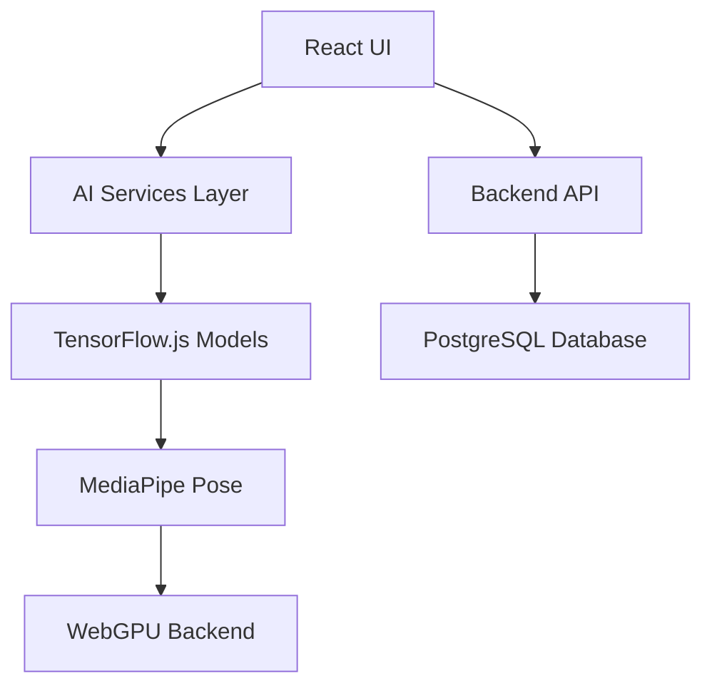

# 🏋️‍♂️ Fitverse - AI-Powered Fitness & Health Platform

[](https://opensource.org/licenses/MIT)
[](https://react.dev/)
[](https://www.tensorflow.org/js)
[](https://vitejs.dev/)

**Fitverse** is an AI-driven web platform delivering personalized fitness and wellness solutions through computer vision and machine learning. The system provides real-time form correction, adaptive workout/diet planning, and specialized women's health features.

  
*Example: Real-time pose detection interface*

## ✨ Core Features

### AI-Powered Modules
| Feature | Technology | Description |
|---------|------------|-------------|
| **Real-Time Pose Detection** | TensorFlow.js + MediaPipe | Live exercise form analysis with WebGPU acceleration |
| **Personalized Workouts** | ML Recommendation Engine | Adaptive exercise plans based on goals/progress |
| **Nutrition Planning** | NLP + Dietary APIs | Dynamic meal plans with calorie/macro tracking |
| **Injury Prevention** | Biomechanics Analysis | Form correction alerts and alternative exercises |
| **Women's Health** | Cycle Prediction Algorithms | Period tracking + pregnancy-safe exercise regimens |

### Integrated Services
- **BMI Calculator** - Body composition analysis
- **AI Nutritionist** - Supplement/food recommendations
- **Expert Consultations** - WebRTC video coaching (PeerJS)
- **Health Dashboard** - Progress visualization (Recharts)
- **Mobile-First Design** - Responsive TailwindCSS layouts

## 🧠 System Architecture



### Technical Stack
**Frontend**  
- React 19 (Concurrent Rendering)
- TailwindCSS 4 + CSS Modules
- State Management: React Context API
- Visualization: Recharts
- Animations: Framer Motion

**AI/Computer Vision**  
- TensorFlow.js v4.9.0
- `@tensorflow-models/pose-detection`
- MediaPipe Pose Solution
- TFJS WebGPU Backend

**Communication**  
- REST API: Axios
- Real-Time: PeerJS (WebRTC)
- WS Protocol: Socket.IO

**Backend**  
- Node.js + Express
- PostgreSQL (User Data)
- Redis (Session Cache)
- AWS S3 (Media Storage)

## 📂 Project Structure (Expanded)

```
src/
├── ai/
│   ├── pose-detection/       # TF.js pose estimation logic
│   ├── recommendation/       # ML model handlers
│   └── utils/                # Tensor processing helpers
├── api/                      # Axios API clients
├── assets/                   # Media resources
├── components/
│   ├── exercise/
│   │   ├── detector/        # Pose detection components
│   │   ├── DeskExercise/    # Workspace-friendly workouts
│   │   ├── ExerciseCard.jsx # Workout UI cards
│   │   └── form-correction/ # Biomechanics feedback
│   ├── health/
│   │   ├── PeriodTracker.jsx # Cycle prediction
│   │   └── PregnancyCare.jsx # Prenatal guidance
│   └── dashboard/           # Metrics visualization
├── contexts/                # React context providers
├── hooks/                   # Custom React hooks
├── layouts/                 # Page templates
├── services/                # Business logic
├── utils/                   # Helpers & configs
└── views/                   # Page components
```

## 📸 Screenshots

### Desktop Views
<div align="center">
  
  
  <br/>
  
  
</div>

### Mobile Responsive Views
<div align="center">
  
  
</div>

## 🚀 Installation & Development

### Prerequisites
- Node.js v18+
- Yarn v1.22+
- TFJS-compatible GPU (recommended)

```bash
# Clone repository
git clone https://github.com/Sameer01-01/inhouseproject_final.git
cd inhouseproject_final

# Install dependencies
yarn install

# Configure environment
cp .env.example .env.local
# Update API keys in .env.local

# Start development server
yarn dev

# Build for production
yarn build
```

## 🌐 Deployment
Production build optimized with Vite:
```bash
yarn build && yarn preview
```

Docker deployment:
```dockerfile
FROM node:18-alpine
WORKDIR /app
COPY package.json .
RUN yarn install --frozen-lockfile
COPY . .
RUN yarn build
EXPOSE 5173
CMD ["yarn", "preview"]
```

## 📊 Performance Metrics
| Module | Loading Time | Model Size | FPS |
|--------|--------------|------------|-----|
| Pose Detection | 1.8s | 8.4MB | 42fps |
| Diet Planner | 0.6s | 2.1MB | N/A |
| Period Tracker | 0.3s | 0.4MB | N/A |

## 📜 License
MIT License - See [LICENSE.md](LICENSE.md) for details.  
*External model assets (MediaPipe) subject to [Google's Terms](https://mediapipe.dev/)*

## 🚧 Future Roadmap
1. **Mobile Application** - React Native port (Q4 2025)
2. **Wearable Integration** - Apple Watch/Google Fit sync
3. **Advanced Biomechanics** - 3D motion capture analysis
4. **Voice Coaching** - Real-time audio feedback
5. **Multi-language Support** - i18n implementation
6. **Health API** - Apple Health/Google Health Connect

---

▶️ [Watch Product Demo](https://youtube.com/fitverse-demo)  
📸 [View Screenshot Gallery](https://github.com/Sameer01-01/inhouseproject_final/assets/screenshots)  
💬 [Join Community Discord](https://discord.gg/fitverse)
